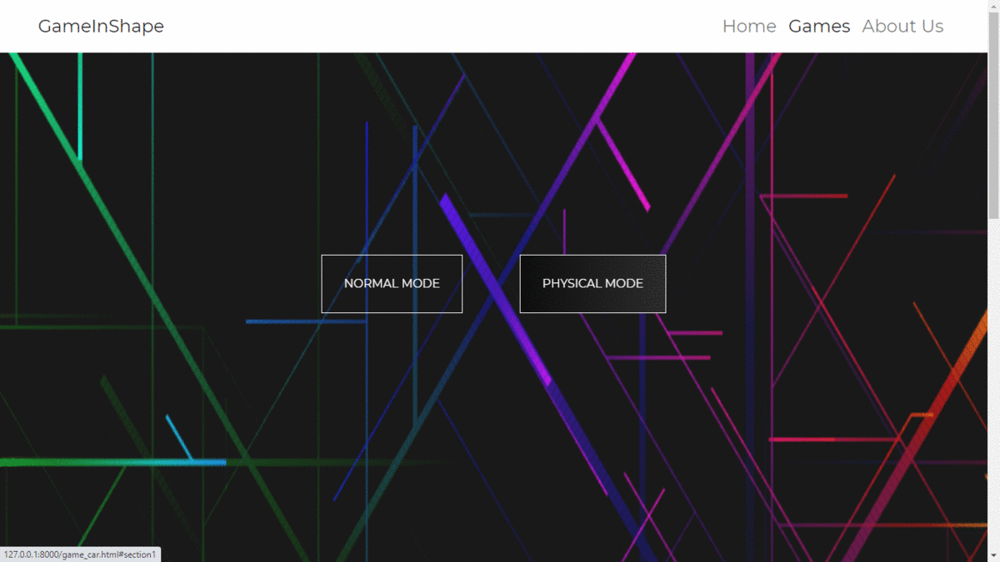

# Overview

#### We can’t compromise on Health by playing Online Games. But we can’t compromise on the enjoyment aspect as well. Is there a way to integrate both of them ? Yes!!
###   &nbsp;   &nbsp; &nbsp;   &nbsp; &nbsp;   &nbsp; &nbsp;   &nbsp;       Online Games ?  &nbsp;   &nbsp;   &nbsp;   &nbsp;   &nbsp;     &nbsp;   &nbsp;   &nbsp;   &nbsp;   &nbsp;        &nbsp;   &nbsp;   &nbsp;   &nbsp;   &nbsp;     &nbsp;   &nbsp;   &nbsp;   &nbsp;   &nbsp;  &nbsp;   &nbsp;   &nbsp;   &nbsp;   &nbsp;     &nbsp;   &nbsp;   &nbsp;   &nbsp;   &nbsp;  &nbsp;   &nbsp;   &nbsp;     Physical Fitness ?

&#8592;&#8594;

- [x]  We introduce you our innovative online gaming platform **GameInShape** that integrates Online gaming with varied levels of physical activity, providing users 
a unique and a flexible gaming experience thereby ensuring physical fitness at the same time. 

- [x]  Users would have a choice to toggle between digital and physical modes of playing the individual games.

# Glimpses of our product
## Watch the Short Video about Project [here!](https://youtu.be/CmwvdUrCMSc) 
<kbd></kbd>
<kbd></kbd>
<kbd></kbd>
<kbd></kbd>

### Currently, Our product supports two popular games: 
- [Mortal Kombat X](https://en.wikipedia.org/wiki/Mortal_Kombat_X)
- [Madalin Stunt Cars 2](https://www.crazygames.com/game/madalin-stunt-cars-2)
### But it is easily scalable to most of the games, We will release the updated version which incorporates many popular games soon!

# Tech Stack 

# Wanna try our Product ? 
Head over this [GameInShape](http://52.15.230.103/) to start! 

# Getting Started
###  Steps to run the Project in your local device !!
- Fork this repository.
- Clone the repository to your System using `git clone`
- Example : `git clone https://github.com<your-github-username>/Innovation-Skyline-2020/GameInShape`
- Create a new Virtual Environment with python 3.8.3 version.
- Install all the dependencies with `pip install -r requirements.txt`.
- Make sure you are in root directory & run the command `python manage.py runserver`. 
- Once it shows `Running on http://127.0.0.1:8000/` go to *http://127.0.0.1:8000/* in your browser. 

# Contributing to Project
**Go through the link If you are new to Open Source Contribution [here](https://github.com/firstcontributions/first-contributions) on making your First Contribution !!**
- Fork this repository
- Clone the repository to your System using `git clone https://github.com<your-github-username>/Innovation-Skyline-2020/GameInShape"`
- Create a branch :-
   - Change to the repository directory on your computer `cd GameInShape`
   - Now create a branch using the git checkout command: `git checkout -b your-new-branch-name`
- Make changes as per your requirement to solve the mentioned issues or new ones and commit those changes.
- If you go to the project directory and execute the command `git status`, you'll see there are changes. 
- Add those changes to the branch you just created using the `git add`. 
- Now commit those changes using the git commit command: `git commit -m "Added the feature of Suggesting Music"`
- Push your changes to GitHub using the command `git push origin <add-your-branch-name>`
- If you go to your repository on GitHub, you'll see a Compare & pull request button. Click on that button.
- Now describe the changes you made and submit the `pull request`.
- Wait for the Maintainers to review :)
- For more detailed Instructions, visit our Contributors Guideline [here](/GameInShape/CONTRIBUTING.md).

## Project Admin

Reach out for queries here : [SanjayMarreddi](https://www.linkedin.com/in/sanjaymarreddi/)

## Contributors
Thanks to all these wonderful developers who made this project awesome!
<!-- If you click on the image it would take to your GitHub profile -->
<!-- ALL-CONTRIBUTORS-LIST:START - Do not remove or modify this section -->
<!-- prettier-ignore-start -->
<!-- markdownlint-disable -->

## License
This project is under [MIT License](/LICENSE) 

